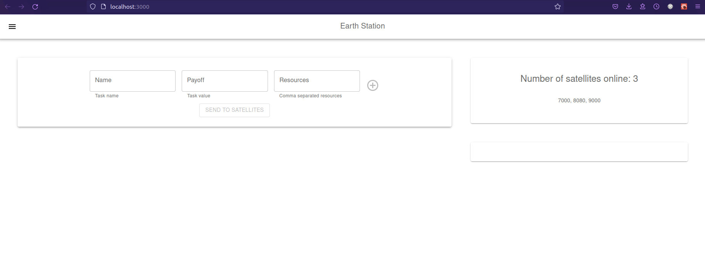
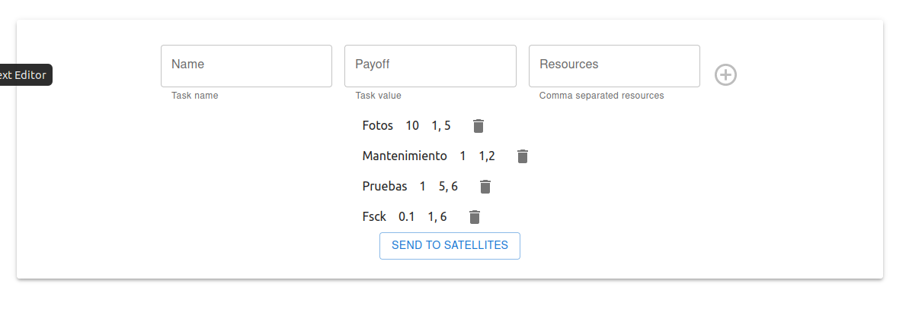
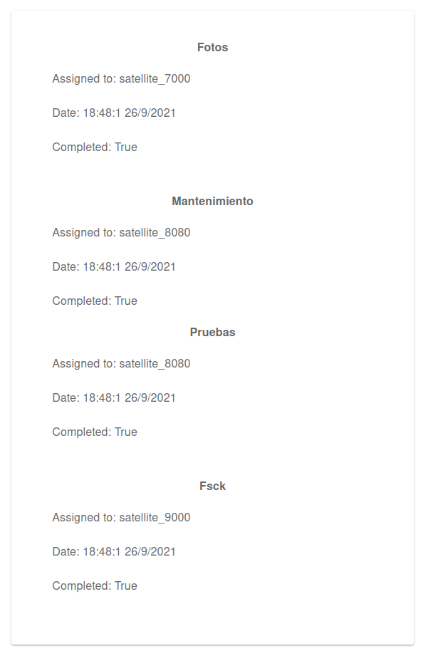
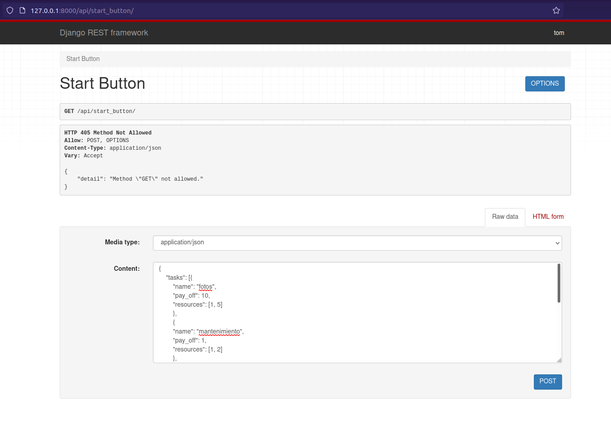

# (26/09/2021) Updates: version 5

## Setup

### Install fades

```
pip install fades
```

## Bootstrap

```
# Build docker images[^1]
make build
# Bootstrap apps
make bootstrap
# Start apps
make up
```
[^1]: Note to my future self: 
```
 $ sudo groupadd docker
 $ sudo usermod -aG docker $USER


If testing on a virtual machine, it may be necessary to restart the virtual machine for changes to take effect.

 $ newgrp docker 

```

## Preload satellites
```
make setup_satellites
```

## Access the React Front

React UI should be accesible at `http://0.0.0.0:4000`

## Monitor application

```
make logs
```

**UI hecha en React.**

**Instrucciones**:


$ python manage.py runserver

$ cd satellogic/satellite_app/

$ python manage.py runserver [elegir un puerto distinto de 8000 y 3000]


Instalar NodeJS


$ cd satellogic/react-ui

$ npm install

$ npm start


**Ir a localhost:3000/**


Al ingresar aparece en pantalla el número de satélites online [en el ejemplo, 3 en los puertos 7000, 8080 y 9000]:



Ingresar nombre, payoff y resources (cada resource debe estar separado por comas):


Ingresar las tareas que se quiera.
Enviar a los satélites para procesar:



Resultados:



# (24/09/2021) Updates: version 4 completa

Start up:

(El orden es importante! Levantar primero el server de Earth.)

a) $ python manage.py runserver

b) $ cd satellite_app/

$ python manage.py runserver [elegir un puerto distinto de 8000]

Repetir (b) las veces que se quiera cambiando el número de puerto.

Al arrancar, cada satélite hace un post request a Earth y se da check-in.

Ir a http://127.0.0.1:8000/api/start_button/



Copiar lo siguiente y hacer click en Post:

> {
    "tasks": [{
        "name": "fotos",
        "pay_off": 10,
        "resources": [1, 5]
        },
        {
        "name": "mantenimiento",
        "pay_off": 1,
        "resources": [1, 2]
        },
        {
        "name": "pruebas",
        "pay_off": 1,
        "resources": [5, 6]
        },
        {
        "name": "fsck",
        "pay_off": 0.1,
        "resources": [1, 6]
        }]
}


Ejemplo con 3 satélites (puertos 9000, 5000 y 4000):


## (23/09/2021) In progress:

Storing a satellite in Earth's db:


Looking if a satellite is already saved in Earth's db:


Processing assigned tasks and sending back the result:


## (22/09/2021) TODO:

Version 4:

Hacer el satélite verdaderamente independiente. [aka Tendría que haber empezado por acá.]

1. Levantar otra app para un satélite en el puerto 9000 darle ID. Sacar el consumer de satélites de la otra app y pasarlo a esta.
2. Registrar el satélite:

	a) Mandar un GET desde el satélite a localhost:8000 buscando #ID9000 (ID del satélite).

	b) Si la ID está, no hacer nada. Si no está, hacer un POST y registrla.

3. En localhost:8000 (Earth). Hacer una query en la tabla y buscar todos los satélites registrados (en el punto 2). Hacer un GET a /health para ver si el/los satélites están en línea.
4. Mandar la data.

Usar Django REST framework.

## (21/09/2021) UPDATES

* Version 3: 
    1. Tests
    2. Navbar
    3. Registro histórico de tareas
    4. Visualización del registro histórico (ir a 'Tasks' en el navbar)


# Abordaje del ejercicio.

Primero me enfoqué en el algoritmo de asignación de tareas. Me pareció que se asemejaba al problema del set packing (a algún tipo de la familia de los set packing problems https://en.wikipedia.org/wiki/Set_packing).

**Código**: https://github.com/TomCastagnino/satellites/blob/main/ground_control/consumers/earth_utils.py

Lo que hice fue primero ordenar la lista de tareas según su peso (pay_off / número de  recursos usados). Para eso usé sorted(). Por lo tanto, la complejidad de mi función sort_task_list() es O(n log n).

Una vez que la lista de tareas está ordenada, uso distribute_task() para asignar la mayor cantidad de tareas posibles a cada satélite. Para eso chequeo que los conjuntos de recursos asignados del satélite y los recursos de la tarea sean disjuntos. Suponiendo que la cantidad de recursos totales es despreciable y puede realizarse en tiempo constante, la complejidad de la función sería O(n) en función de len(tareas).

(Nota: distribute_task() devuelve una lista nueva, no modifica la existente. Dentro de lo posible, intento que las funciones sean puras.)

El último paso es repetir distribute_task() por el número de satélites. Considerando que el objetivo de Satellogic es tener 300 satélitese para el 2025, supongo que este número puede tomarse como una constante.

Este algoritmo no es dependiente ni del número de recursos ni del número de satélites. Sí estoy asumiendo que todos los satélites cuentan con los mismos recursos.

Posible mejora: si conociera los recursos disponibles de casa satélite, podría hacer el algoritmo más eficiente al salir del loop cada vez que los recursos totales del satélite estén ocupados.

En cuanto a la arquitectura, decidí usar django-channels con Redis y docker. Nunca había usado ese stack. Otras opciones que evalué fueron usar Celery y RabbitMQ. También pensé en usar AWS.

**Funcionamiento de la app**:

Instalar Docker y correr: $ docker run -p 6379:6379 -d redis:5

Ir a localhost:8000/ground_control y seleccionar el número de satélites:


Al ser redirigido a la siguiente pantalla, hay un ejemplo ya cargado. El ejemplo se puede modificar, siempre y cuando se respete la misma estructura del JSON y se mantengan las Keys.


Apretar 'send'. Para borrar los registros, CTRL + F5


Para el desarrollo, me basé en https://channels.readthedocs.io/en/stable/tutorial/part_1.html